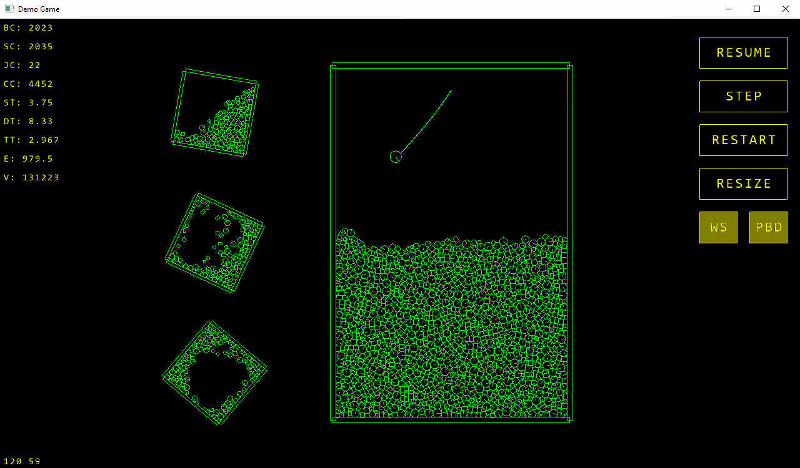

# Game Framework

A high-performance, cross-platform 2D game framework written in C99.

## Getting Started

Initialize the engine by the following configuration and event-driven lifecycle:

1. **Configure Application**: Before creating the window, set the required metadata using the `config` system.
    ```c
    config_set_value(CONFIG_KEY_WINDOW_TITLE, "My Game");
    config_set_value(CONFIG_KEY_WINDOW_CLASS, "MyGameClass");
    config_set_value(CONFIG_KEY_FOLDER_NAME, "MyGameData");
    ```

2. **Initialize Window**: Call `window_create(width, height)` to finish the platform-specific initialization.

3. **Main Event Loop**: Process system events and manage the graphics context.
    ```c
    while (window_is_open()) {
        Window_Event event;
        while (window_poll_event(&event)) {
            if (event.type == WINDOW_EVENT_WINDOW_CREATED) {
                graphics_init(event.state_event.window);
                // load textures...
            }
            if (event.type == WINDOW_EVENT_WINDOW_DESTROYED) {
                graphics_uninit(event.state_event.window);
            }
            // handle events...
        }

        // Update
        input_update();
        physics_world_step(world, delta_time, true, true);

        // Render
        graphics_clear(&clear_color);
        // draw scene...
        graphics_display();
    }
    ```

### Android Deployment
Before deploying to Android, update the project files in `platform/android/`:
- Change the `package` attribute in `AndroidManifest.xml`.
- Change the `app_name` value in `res/values/strings.xml`.
- Replace the provided `game.keystore` with your own keystore.
- Enter the signing credentials in `build.xml` (key.* properties).

## Project Structure
The core engine logic and platform-specific backends are separated, making the game layer platform independent:
- **`source/game/`**: High-level application code utilizing the engine's API.
- **`source/engine/`**: Platform-independent modules for physics, graphics, geometry, input, and memory management.
- **`platform/`**: Native implementations for Windows and Android.

## Components

### Physics
A custom 2D rigid-body physics simulator:
- **Collision Detection**
    - **Broad Phase**: Efficient **Sweep and Prune** algorithm and **AABB Test**.
    - **Narrow Phase**: **Separating Axis Theorem (SAT)** for polygons and specialized routines for circles and segments.
- **Constraint Solver**: Impulse-based velocity solver with position correction to resolve overlaps without adding extra energy to the system.
    - **Functions to ensure solution convergence** (by applying artificial impulses):
        - **Warm-Starting**: Apply the total impulse generated by each constraint in every frame.
        - **Position Based Dynamics**: Convert position changes back into velocity.
- **Contact Manifolds**: Multiple contact points are generated as necessary for more accurate simulation and jitter-free stacking.
- **Automatic Mass**: Physical properties (centroid, linear mass, inertia) are automatically calculated based on collider geometry and density.
- **Filtering**: Mask and group-based collision filtering with sensor support (callbacks without physical resolution).
- **Memory Pools**: Cache-friendly allocation of the physics objects.

### Graphics
A simple 2D rendering API for maximum compatibility:
- **Primitives**: High-level draw functions for segments, circles, polygons and rectangles.
- **Transform Stack**: Full support for hierarchical transformations (Translate, Rotate, Scale).
- **State Stack**: Push/pop graphics states including colors, textures, and line properties.
- **Typography**: Sprite-font system with alignment and formatted string support.

### Audio System
Multi-platform audio engine for consistent sound effects:
- **Asynchronous Mode**: Sounds are played in the background without halting the application.
- **Simulataneous Playback Support**: Multiple audio files are playable at the same time.
- **Sound Control**: Volume control, pause, resume, and seeking functionality.

### Window System
A unified event-driven windowing system that abstracts platform-specific lifecycles:
- **Windows Backend**: Managed via a standard Win32 `WNDCLASS` and `window_proc` callback.
- **Android Backend**: Integrated with `NativeActivity`, handling the asynchronous nature of mobile app lifecycles.
- **Event Loop**: Use `window_poll_event` to handle a variety of events including touch/mouse input, key presses, and window state changes.
- **Unified Input**: Mouse clicks are mapped to `WINDOW_EVENT_TOUCH_*` events, providing a consistent interface for both desktop and mobile platforms.

### Asset System
Assets are managed through a platform-agnostic interface with specialized loading strategies:
- **Windows Backend**: Extracts embedded resources into a local temporary folder (configured via `CONFIG_KEY_FOLDER_NAME`) to make assets readable via standard file I/O.
- **Android Backend**: Leverages `AAssetManager` to read assets directly from the APK for efficient streaming of audio and image data.

## Platform Implementations
### Windows
- Rendering API: Desktop **OpenGL** using fixed-function pipeline.
- Audio Playback: Implemented via **DirectShow** (Graph Builder) supporting modern formats.
- Windowing System: Standard Win32 `WNDCLASS` and `window_proc` callback.
- Asset Management: Embedded resources are extracted into a local temporary folder to make assets readable via standard file I/O.

### Android
- Rendering API: **OpenGL ES 1.1** utilizing vertex arrays.
- Audio Playback: Native integration with **OpenSL ES** for optimized mobile performance.
- Windowing System: Integrated with `NativeActivity`, handling the asynchronous nature of mobile app lifecycles.
- Asset Management: Files are read directly from the APK using `AAssetManager`.

## Technical Philosophy
- **Zero Dependencies**: No 3rd party libraries are used, only platform-native APIs and standard C99.
- **Encapsulation**: Platform-specific headers (like `windows.h` or `GLES/egl.h`) are hidden within the platform layer to ensure fast compilation of game code.

## Demo Screenshots


